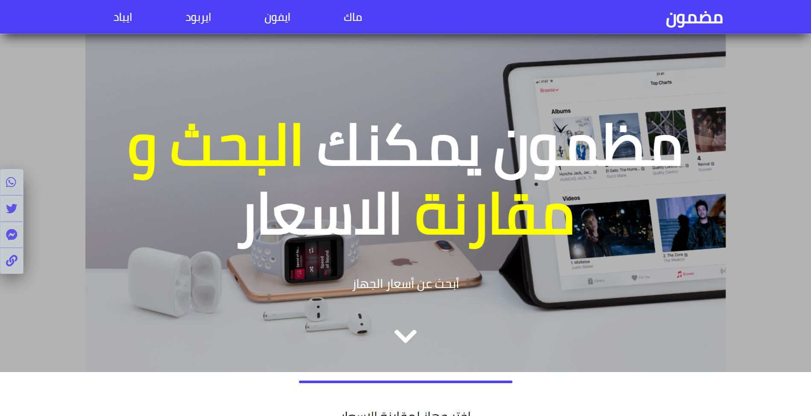

# Front-end part for Madmoun website

This is the Front-end part of Madmoun website, link to website to be added later.

## Instructions

1. Download or clone repository
2. Double-Click on index.html

## Authors :bust_in_silhouette:

### Ayman Jabr

\_[Github](https://github.com/AymanJabr/)
\_[LinkedIn](https://www.linkedin.com/in/ayman-jabr-3705a4100/)

## Show your support :star:️:star:️:star:️
Give a star if you like this project!

## License :memo:
All Rights Reserved

Copyright (c) 2021 Ayman Jabr

THE SOFTWARE IS PROVIDED "AS IS", WITHOUT WARRANTY OF ANY KIND, EXPRESS OR
IMPLIED, INCLUDING BUT NOT LIMITED TO THE WARRANTIES OF MERCHANTABILITY,
FITNESS FOR A PARTICULAR PURPOSE AND NONINFRINGEMENT. IN NO EVENT SHALL THE
AUTHORS OR COPYRIGHT HOLDERS BE LIABLE FOR ANY CLAIM, DAMAGES OR OTHER
LIABILITY, WHETHER IN AN ACTION OF CONTRACT, TORT OR OTHERWISE, ARISING FROM,
OUT OF OR IN CONNECTION WITH THE SOFTWARE OR THE USE OR OTHER DEALINGS IN
THE SOFTWARE.
